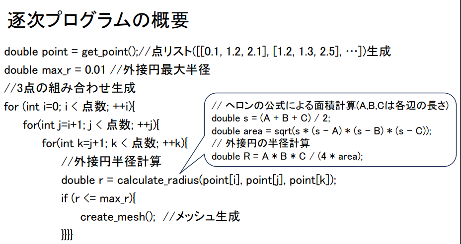
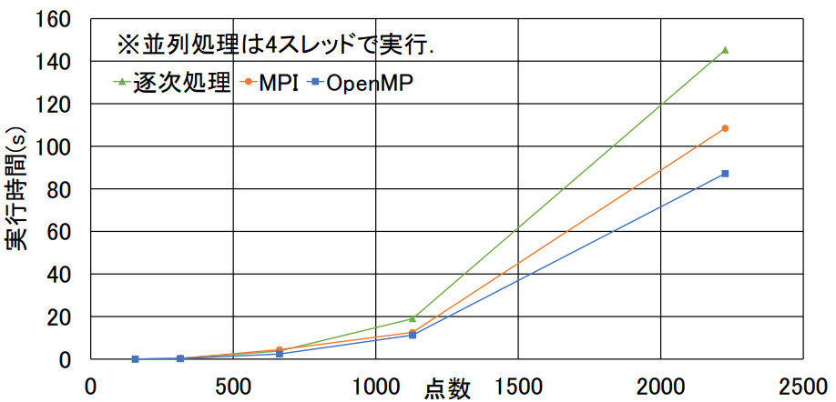

# High-performance parallel processing (implementation of Ball-Pivoting Algorithm)

Ball-Pivoting Algorithmを高性能並列処理で実装し、性能評価します．

## 概要

これはBPA(Ball-Pivoting Algorithm)をMPIやOpenMPで並列処理し，性能を評価します．
頂点(点群)数が異なる5種類の3DデータをそれぞれBPAで処理を行い，性能評価します．

### BPA(Ball-Pivoting Algorithm)とは
3D or 2Dの点からCGのポリゴンとして扱われるメッシュを生成するアルゴリズムです．点群データの中から点を3つ選び，3点を通る外接円の半径を計算します．半径が一定以下であれば，その3点を頂点とするメッシュを生成します．

### 逐次プログラムの概要
3重のfor文で点群データから3点の組み合わせを生成します。その3点を通る外接円の半径が一定以下である場合，その3点をメッシュとして登録します．

### 逐次処理による点数と全体実行時間の関係

### MPIとOpenMPによる並列プログラムの概要

### 逐次処理と並列処理による点数と全体実行時間の関係

## 期間
2週間

## 言語
言語：C

## 開発環境
個人開発でLinux環境で開発を行いました．

## 制作背景
大学の授業で並列処理を学ぶことを目的として作成しました．
